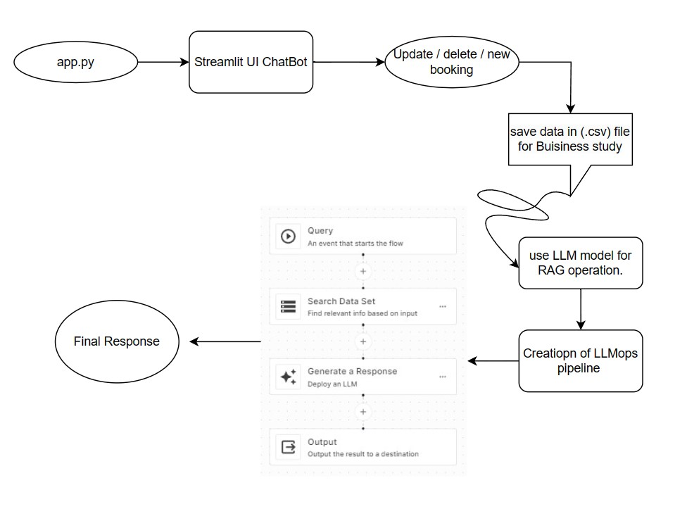

# chipmonk_chatbot_system

## steps to RUN :-

1. Clone the REPO .(VS CODE)
2. select latest python env.
3. run (pip install -r requirements.txt)
4. run (streamlit run chat_history_latest_latest_latest.py)

